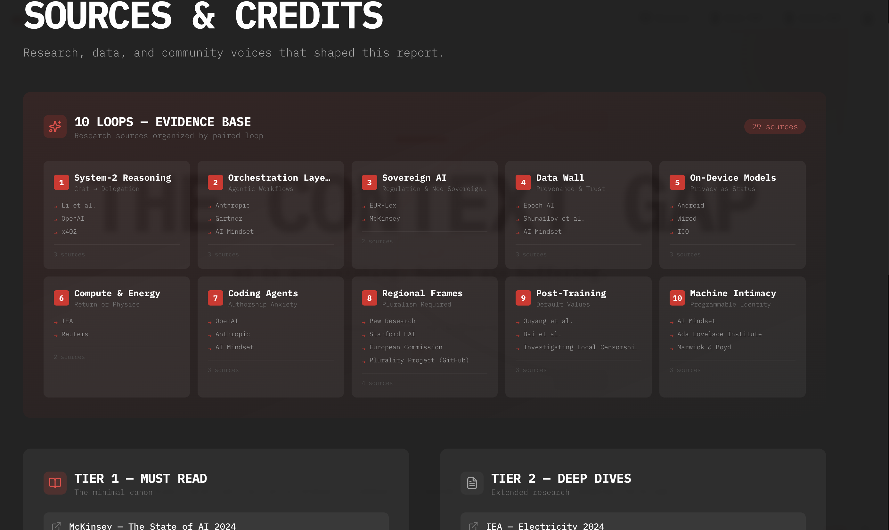
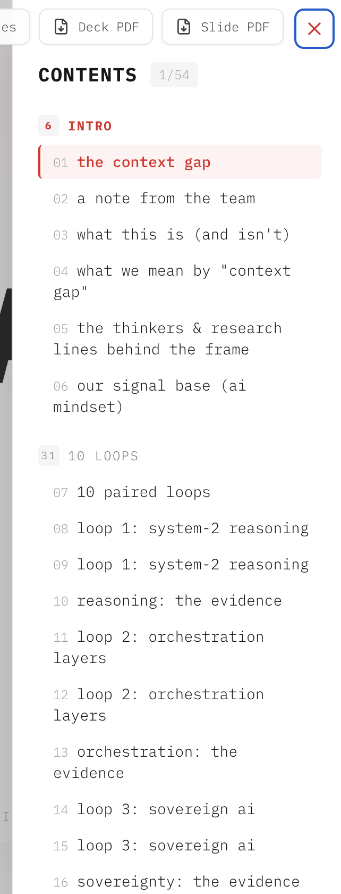
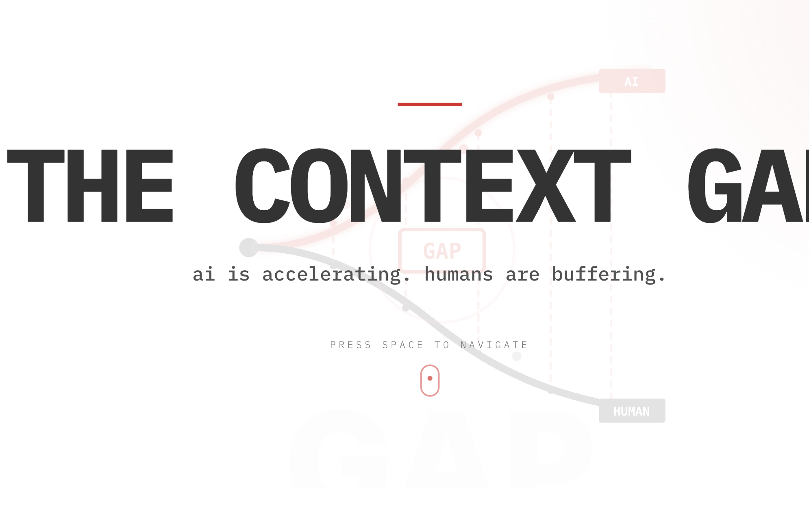
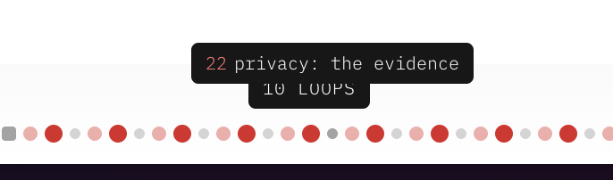
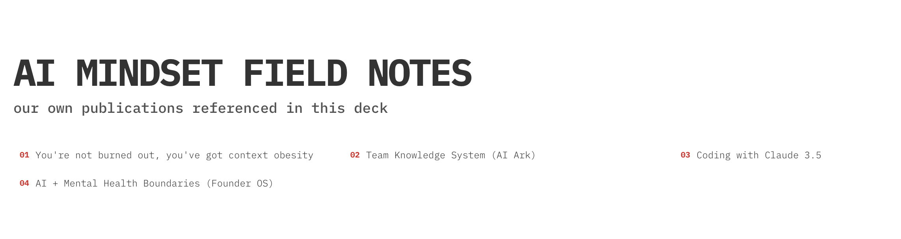
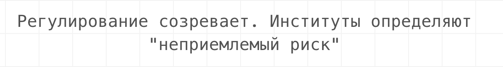

#   
  
  
  
окей. погнали дальше. мои мысли о текущей версии презентации и что улучшить  
  
пока просто в файл записывай  
  
  
```
humans are buffering – negative. 
humans responding? adjusting? 

not only space. all the different inputs shall work – scroll, keyboard etc


```
  
  
  
  
вот в таком формате сделать Map of content!  
  
**TIER тоже непонятное слово**  
  
**Anca – product and design review**  
  
  
  
  
  
**как будто энциклопедию читаю. сложно, не хочется так думать**  
  
  
  
**human видно ai не видно**  
  
  
**ai and human are connected… and separated too.**  
  
  
**“**the year **context became expensive**.**” не понятно для тех, кто не был на лабах. даже мне пришлось напрячься подумать**  
**A NOTE FROM THE TEAM – после репорта. и более живой, свой **  
  
  
navigation tool – вот эту метафору хочется взять. не презентация, а tool.   
**the human layer??? wtf?? сам ты layer**  
  
  
  
**прикольно но слишком мелко, при наведении что бы увеличивались / раскрывались в ака каталог**  
  
  
  
we're trying to show **what changed**, **why it matters**, and **what the human layer can do** — so you can make better calls in 2026.  
вот это в сторителлинг первой странице. это репорт о том, что происходило и что зафиксировалось.   
  
   
  
  
made in collaboration with AI label  
  
  
AI Report  
  
HOW AI world changed  
according to … researches  
carefully combined by our team (link)  
  
скролл обязательно, кнопки не привычно  
  
```
WHAT THIS IS (AND ISN'T)

```
  
очень непонятно по названию и контенту  
  
  
```
YOU'LL GO THROUGH 10 PAIRED LOOPS

```
* 
**machine signal** (capability / deployment / economics)

**human signal** (cognition / identity / culture)

**the context gap** (where coordination breaks)  
…. тут больше непонятных мне слов, чем понятных  
  
переделать или объяснить все слова  
  
  
```
THIS ISN'T секция – нахуя? показать, какие вы классные?

```
  
```
WHAT WE MEAN BY – опять про вас. еще ничего полезного не получили, а уже два раза про вас почитали

```
  
  
```
the context a system needs to act well – чтооо? я ходила на ваши лабы и я понимаю английский, но даже я не понимаю вот это... 

```
  
  
  
  
```
WHAT WE MEAN BY "CONTEXT GAP"

the distance between:

1. the context a system needs to act well

and

2. the context a human can actually hold without degrading decisions.


and the real losses:

time (the non-renewable one)

money (busy ≠ effective)

reputation (sloppy decisions, missed nuance)

```
  
я не понимаю этот текст. это большая часть сторителлинга и по идее это то, что должно быть на первой странице, но это надо по-другому подать и объяснить   
  
хочется что бы не возвращало каждый раз на первую страницу когда ненадолго отвлекаюсь от окна   
  
  
  
```
THE THINKERS & RESEARCH LINES BEHIND THE FRAME – вот это совместить со страницей про что такое контекст

```
вообще этот слайд не очень понимаю. это уже начало презентации? но еще не лупы? мм?  
  
  
```
OUR SIGNAL BASE (AI MINDSET)

```
оо! опять про вас! класс! а когда уже репорт начнется?  
и почему это называется сигналы? а не слоны, звездочки или любое другое рандомное слово?   
6 лакс – не больше было не?   
200 человек? точно больше   
100 часов – точно больше  
67 completion – Ну, для человека, который вообще не знает, что такое, что он сейчас читает, вообще непонятно.   
  
И вот тут видно, что у тебя процент completion и что. Даже не особо понятно, что это вообще пропустит.   
  
Читаем их репорт, но почему-то так и всё ещё не дошли до репорта.   
  
Смотрим на цифры. 
Цифры эти классные, когда это сайт портфолио или сайт про проект, но мы тут пришли репорт читать.   
  
Мы уже на шестой странице и все еще его не читаем.   
  
  
  
  
```
EACH LOOP ENDS WITH THE GAP — AND WHERE COORDINATION BREAKS.

```
```


```
Я НЕ ПОНИМАЮ  
  
  
Все-таки формат презентации кажется очень неудобным для меня.   
  
Типа я вижу страницу, на которой есть одно предложение, и это, конечно, красиво, но то, что я не могу с этим ничего сделать, типа посмотреть дальше, мне нужно постоянно кликать на кнопки.   
  
Это неудобно, в том числе потому что не знаю, для меня кнопки "влево-вправо" дорогие, кнопки там только мизинец находится.   
  
Ну, короче, неудобно, непонятно, почему в вебе мы смотрим презентацию  
  
Короче, как я понимаю, как человек, который еще не смотрел research и только на 8 странице находит это про то, что были какие-то исследования, и у них есть какие-то выводы.   
  
Loop, то что ребята называют лупами, — это выводы. Вывод номер один: система **System Tourisming**. Что это, блять, значит? **System 2 reasoning**?   
  
Chat is turning into delegation – Вот это понятнее. Может быть, его надо небольшими буквами.  
  
Короче, не объяснено нормально, что это лупы и на что мы его смотрим. Хочется придумать название, соответствующее тому, на что мы смотрим.   
  
  
на 9й странице наконец начинается красивый дизайн. хорошо, что дожили до нее.  
  
  
Не понимаю. Вот я смотрю loop1, там есть под "the context gap". На слайде 9 есть evidence с тремя ссылками. Потом открываю страницу, и там еще одна evidence, и опять с ссылками, только с другими какими-то. Зачем она и там, и там?   
  
И та же ситуация с ссылками, только их тут теперь 4.   
  
Industry signals — почему, блин, это называется сигналы? Ты мне можешь объяснить?   
  
Research говорит, что O3 achieves 2,727 code forces ratings. Блин, мне кажется, на самом деле, что если я пойду смотреть эти research, выводы будут другими.   
  
Кто делал эти выводы? Подскажи, это не Неронка делала, или это специалисты?   
  
Не знаю, каким образом то, что 717 процентов in AI verified, связано с тем, что чат is turning into delegation. Но это же должно быть связано, правильно? Это же evidence дипсик чепилотан о ван, как и связано с первым лупом??  
  
  
  
Чем loop1 отличается от loop2?   
  
В первом loop'е мы говорим, что мы отдаём делегацию: "delegation" чата превращается в делегацию.   
  
А во втором loop'е мы говорим, что всё переходит от чата к агентному рабочему процессу.   
  
Это не то же самое? От чата к делегации, а от чата к агентному рабочему процессу.   
  
  
  
```
LOOP 2: ORCHESTRATION LAYERS

```
  
Почему-то самые большие слова несут самое большое отсутствие смысла.   
  
*Orchestration layers.*   
  
Что это должно значить? Почему мне хочется зайти на этот слайд и почитать какой-то луп про какой-то *orchestration layer*? Даже я, человек, связанный с AI, интересующийся и любопытный, не хочу туда заходить и читать.   
  
Кажется, я начинаю понимать. Первый лоб — это больше про то, что, что бы там ни делали агенты, есть люди, slow thinking moves, которые делают правильно или, бл*дь, неправильно.   
  
Я прочитала всю страницу и все evidence, но это не помогло разобраться, какой вывод.   
  
  
  
Получается, что **Context Gap** — это на самом деле Machine change, human react."   
  
This is the patterns we see from 2025:  
a, b, c…   
Как это связано с контекстом и почему это "гэп", а не “реакция”, я не понимаю пока.   
  
  
а почему overload becomes baseline это reaction,  а не… не знаю, результат? influence on human?   
  
  
Research:   
Platinum members: Amazon, Anthropic, Google, Microsoft, OpenAI  
  
Что это, блядь, вообще значит? Это не ссылка. Если это какой-то вывод, что это значит? вывод, что вот эти компании: Platinum Members.  Of what? Of Orchestration?   
  
  
  
для слов типа Sovereign AI хочется, что бы про наведении на мышку раскрывалось, что это значит.   
  
  
a personal version emerges: **neo-sovereignty**.  
people build their own spaces (private notes, smaller circles, local tools) because public feeds feel noisy, extractive, increasingly synthetic.  
  
не очень понятно, про что это. build smaller circles.. for what? to use AI together or what?  
  
Мой пойнт ещё в том, что наверняка найдутся люди, которым интересно посмотреть все выводы, но не очень интересно заходить в эвиденс, сурсы и так далее.   
  
А тут мы обязываем пройти всё. Это тоже какой-то такой… Проще отказаться и вообще не читать, чем через это проходить.   
  
  
  
  
  
again…   
**KEY DATA**  
**30%**  
Chinese open-source LLM global share (from 1.2%)  
ChinaTalk 2025  
**90-95%**  
DeepSeek cost reduction vs OpenAI o1  
DeepSeek 2025  
**10M+**  
Qwen app downloads in one week  
Alibaba 2025  
  
  
how does this support **ON-DEVICE MODELS ↔ PRIVACY AS STATUS point?**  
  
почему на 6м внезапно поменялся дизайн?   
менять чаще или не менять вообще?   
  
  
непонятно, где мы, если не двигать стрелки   
  
  
на черном фоне мне больше нравится  
  
  
  
  
energy economics turns personal: burnout realism, fatigue, "time hangover," sharper awareness of biological limits.  
people begin optimizing for sustainability, not maximum output.  
….. суука… кааак это связано с ai is infrastructure??? и **COMPUTE & ENERGY ↔ RETURN OF PHYSICS?? **  
energy economics turns personal: burnout realism, fatigue…. что? ну чтооо? про что это?   
  
  
  
почему иногда у нас INDUSTRY SIGNALS это что люди думают, а иногда просто список….  
Stargate  
NVIDIA  
AMD  
Power grid  
Nuclear?  
  
  
  
  
может в sources добавить what to read, и там всякие статьи из ai mindset?   
  
  
  
и все-таки… это у меня проблемы с английским или вывод не должен быть… таким?  
METR Study paradox: experienced devs **19% slower** with AI, believe **20% faster**  
  
так slower или faster? believe was или что?   
  
не все тексты – тексты, которые можно скопировать. это неудобно   
  
  
**71%**Using GenAI in business functionsMcKinsey 2025  
каким образом это key data к тому, что в разных регионах разные governance?  
  
  
people cluster into micro-realities and micro-truths.  
что?  
  
34 – все. я устала. очень устала. а это я еще не читала все…  
  
  
мы говорим про machine intimacy а потом вдруг в evidence key numbers… **87%**Organizations attacked with AI-assisted threats?? что?? это главная цифра факта, что мы используем ai для получения внимания?   
  
  
  
**MACHINES, SUMMARIZED (2025 → 2026)**  
может вот это в начало, а потом объяснить все это подробнее? что бы знали, куда мы вообще идем  
  
очень отвлекающая тревожная анимация на фоне  
  
  
what changed in humans:  
what changed in machines:  
  
гораздо более подходящие слова чем какой-то там все еще непонятный мне context gap / loops и тп   
  
  
**CALL TO AGENCY тоже очень anxiety animation **  
  
  
  
  
**SURVIVAL KIT **классная часть. анимация опять слишком быстрая  
другой дизайн, не как предыдущие слайды?  
  
**COMMUNITY SIGNALS **  
**почему называется сигналы?**  
  
  
  
  
  
```
if this artifact helped you name the friction — don't lose the thread.


```
oh! so now we call it a friction… not a loop or gap anymore?  
  
  
```
sources а зачем нужны отдельные, если у каждого лупа есть свои? в чем отличие? просто что ту все в одном месте?

```
но там же они тоже разделены по темам… почти тем же, что loops… только по-другому. зачем-то…   
  
  
хорошая страница, но тут я бы с какими-то descriptions сделала этот   
  
  
теперь читаю все то же самое на русском   
  
  
  
AI ускоряется. Люди буферизуют. на русском понятнее не стало) ну и все-равно какое-то негативное по отношению к людям  
  
содержание тоже нужно переводить   
  
  
  
Мы создали это, потому что 2025-й не ощущался просто годом. Это был год, когда контекст стал дорогим ресурсом.  
  
….  я не понимаю поинта.  очень смутно его понимаю, как человек, который был на двух лекциях context lab, но… ??  
  
  
люди научились  медленнее удерживать смысл, внимание и направление. что? это как? может русский язык я тоже не знаю? медленно удерживать смысл это как?  
  
  
  
Мы показываем что изменилось, почему это важно – вот это классный подход. только он не соответствует продолжению презентации.  
  
и как человеческий слой реагирует — чтобы вы принимали лучшие решения.   
человеческий слой блять… это что за слой такой? есть земля, птицы, слой бизнеса, слой машин слой аи и вот слой людей тоже, правильно понимаю?  
  
каким образом реагирование этого слоя помогает… принимать читателю лучшие решения?   
  
Идея сделать презентацию по указу на счет двигателей в целом классная. Она показывает, как эти двигатели влияют и каким образом. Возможно, у тебя есть какие-то советы или много информации в форме дозы.  
  
Важно объяснить так, чтобы люди могли принимать лучшие решения. Вообще, это офигенно! Но на то, что происходит, с чем это связано, презентация этому не соответствует.   
  
Во-первых, я просто не понимаю, как это должно работать. Я прочитала, что у тебя в регионах происходит что-то разное с AI, и это уже не так просто связано с тем, как я буду принимать выбор на лучшие решения.   
  
Короче, идея классная, и хочется ее доделать так, чтобы она действительно работала, а не была просто красивыми словами в начале презентации, которые потом забываются, потому что ничего подобного дальше не происходит  
  
  
  
  
Парная карта · не хайп-презентация · не моральная паника  
  
  
А что это за термин такой? Прекрасная моральная паника.   
  
Может быть, я бл*ть, все-таки как-то из языков не знаю.   
  
Ну какие мы молодцы, что сделали х*й презентацию. Сделали просто что-то красивое, и х*й они х*ящие.   
  
Ну что за парная карта? О чём вы так могли сказать? О чём вы были именно так?   
  
  
  
  
Мы объединили шесть исследовательских потоков в одну парную историю  
  
Исследования сельских потоков, парные истории.   
  
Вполне у меня нет ничего, метод.   
  
А там еще и методом назвали.   
  
Ну удобно взять, если непонятные слова, и назвать это методом.   
А кто-то в курсе вообще, что такое индустриальные данные?  индустриальные — это в смысле, как индустриальная революция, или что?   
  
Да, метод надо какой-то такой, где-то раньше и каким-то другим языком, и как-то по-другому так написать, что не метода.   
  
Смотрите, мы взяли разные истории, разные данные и разные аналитики, разные какие-то рекорды. Выбрали из них самое важное.   
  
Вот теперь мы вам покажем, что, по нашему мнению, из них самое важное. Ведь такое для меня был бы понятен начальный старидеринг, а не исследовательские потоки, выделенные в одну парную историю.   
  
Одна парная история… эх…  
  
  
  
  
```
ОТСУТСТВИЕ ФИЛОСОФА

Три мыслителя доминируют в AI-дискурсе 2025 (и никто не моделирует человеческую адаптацию)

```
Можно я ничего не буду говорить в этот слайд? Просто поиспалм и свисталм. Прочитаю его и прощу, и буду дальше.  
  
Что, блять? Какие три мыслителя? О каком AI дискурсе? Никто не моделирует человеческую адаптацию. Ну хотя бы, блять, написали бы, к чему. AI изменения. Моделируют?   
  
Во-первых, никто это не делает. Мне кажется, слишком ответственным так заявлять. Во-вторых, что он что-нибудь моделирует? Никто его не изучает? Или все-таки он реальную модель создает? Это то, что эта презентация тоже не делает, если что.   
  
  
  
  
```
Если это окажется полезным — перешлите коллеге. Поделитесь слайдом, который точно описал вашу боль.

```
```


```
ааа… так мы тут все-таки про списывание болей!!  
  
  
  
  
```
КАЖДЫЙ ЦИКЛ ЗАКАНЧИВАЕТСЯ ТАМ, ГДЕ ЛОМАЕТСЯ КООРДИНАЦИЯ

```
```


```
ааааа чтооооо????  
  
можно мне гайд по этому репорту, пожалуйста?  
  
…. Не, это все-таки, наверное, не носитель русского языка, или регулирование созревает.   
  
Интересно, а вот англоязычные ребята на английском тоже это читают?   
  
Вот примерно так же, как я сейчас на русском, думаю: "Что за пиздец? Это ничего не значащие слова."   
  
  
Всё, я не могу это дальше читать. пошли переделывать.   
